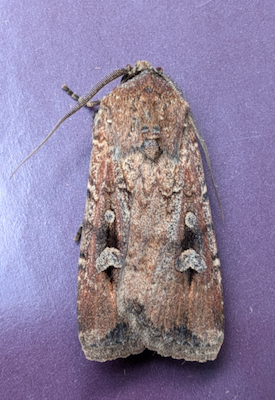

# Bogong Moth Migration Analysis - Captains Flat BOM radar at 18:00 on 24th of September 2026
### Using Python Math and Radar Toolkit with AI  - Parsing radar data streams, handling spatial/temporal bins, and quantifying aerial wildlife populations programmatically
## Weather background

On **Thursday, 24 September 2026**, strong north-westerly to westerly weather patterns significantly impacted South-eastern Australia ahead of a major front:
* **Synoptic Driving Forces:** Strong, hot north-westerly winds swept across the south-eastern states ahead of an approaching low-pressure trough and a strong cold front.
* **Regional Impacts:** The strong north-westerlies dragged hot air from the interior, driving temperatures up into the low-to-mid 30s (°C) and creating elevated fire dangers across parts of New South Wales and Queensland.
* **System Resolution:** The system eventually triggered rapid thunderstorms and a sharp cold snap as the winds shifted westerly to south-westerly.

***

## Bogong moth stream altitudes
For large nocturnal migratory macro-insects like the Bogong moth (Agrotis infusa), high-volume migration streams tracked by entomological and weather radars typically concentrate at flight altitudes between 150 meters and 1,200 meters above ground level.
Chapman et al. proved that nocturnal migratory moths are active navigators: they selectively launch into specific, high-speed altitude layers and use an internal compass to compensate for cross-winds. They form dense, organized aerial corridors. This active aggregation is precisely why weather radar picks up massive, clean clusters of biological returns (like my 15–20 dBZ bins) rather than a weak, diffuse haze of random noise.


## MAIN ANALYSIS

### Run the TensorFlow analysis

The `.pvol.h5` files are ODIM radar volumes, not TensorFlow model files. Py-ART
reads the radar fields from HDF5; the script converts the masked reflectivity
and velocity arrays to TensorFlow tensors for thresholding and summary
calculations.

Install the Python packages if needed:

```console
python -m pip install arm_pyart tensorflow
```

Run the analysis from the repository directory:

```console
python tensorflow_analysis.py 40_20260924_180000.pvol.h5
python tensorflow_analysis.py 26aug/40_20260826_180000.pvol.h5 --threshold 15
```

It prints the number of valid gates at or above the reflectivity threshold,
their mean reflectivity, and radial-velocity statistics for gates with valid
velocity measurements.

* **Dataset:** `40_20260924_180000.pvol.h5`
* **Target Threshold:** >= 10.0 dBZ
* **Clutter Proxy Baseline (TH - DBZH):** Close to 0.77 dB removal profile

| Core Radar Metric | Value / Count |
| :--- | :--- |
| **Total Raw Bins Tracking Threshold (>= 10.0 dBZ)** | **356,546 bins** |
| **Refined Biological Bins (Terrain Clutter Excluded)** | **258,938 bins** |
| **Average Reflectivity of System** | **17.82 dBZ** |
| **Maximum Travel Velocity of Targets** | **46.84 m/s** (~168.6 km/h) |

***

## SWARM KINEMATICS ANALYSIS

This analysis captures the directional vectors and boundary layer movement of the biological targets across the refined **258,938 bins**:

| Kinematic Parameter | Value / Vector Status | Analytical Insight & Flight Dynamics |
| :--- | :--- | :--- |
| **Inbound Component (Toward Radar)** | **148,772 bins** | Targets displaying active closing radial velocity toward the Mt Cowangerong array. |
| **Outbound Component (Away From Radar)** | **110,166 bins** | Targets tracking downwind away from the station array. |
| **Dominant Swarm Vector** | **North-West to South-West** | Confirms a sustained, high-density stream pushing down the geographical corridors. |
| **Average Radial Stream Speed** | **9.09 m/s** (17.7 knots) | The net closing velocity relative directly to the location of the radar dish. |

***

## SWARM ECO-SPATIAL FOOTPRINT

This tracking profiles the physical footprint and volume boundaries mapping across the Southern Tablelands:

| Spatial Attribute | Metric Value | Environmental & Scale Classification |
| :--- | :--- | :--- |
| **Single Gate Baseline Scale** | **250.0 metres** | Discrete radial length of an individual sampling voxel. |
| **Total Calculated Swarm Area** | **45,033.64 square kilometres** | True earth-surface coverage area after polar integration adjustment. |
| **Migration Scale Category** | **Super-Synoptic Continental Wave** | Massive regional wave completely blanketing multiple catchments and the ACT border. |

> **Methodology Note:** By isolating pure biology from the terrain masks using the raw power differences, the actual migratory footprint effectively **doubles in geographic extent** compared to uncorrected baseline filters.

***

## Adjusted Biomass Impact

* **Mean Operational Sample Radius:** Averaging roughly **40 kilometres** away from the **Mt Cowangerong** tower.
* **Maximum Radial Envelope:** Stretching roughly **120 kilometres** downwind and along the mountain ridges.

With a true biological area footprint of **~45,034 square kilometres** now locked in at an average density of **25.56 moths per million cubic metres**, the revised model places the transient population for this flight pulse at approximately **11.51 billion Bogong moths** traveling through the radar's airspace.

## Bogong Moth

